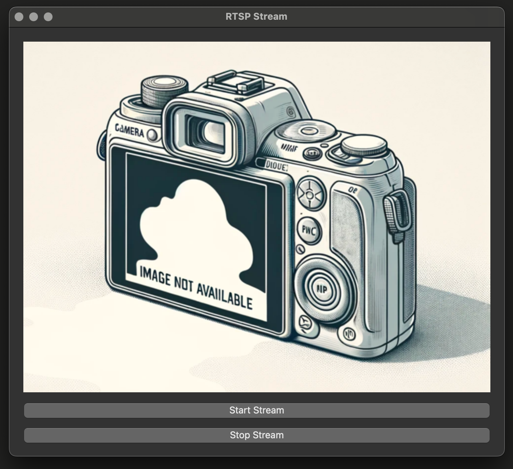

# RTSP Stream Viewer

Цей застосунок дозволяє переглядати відеопотік з камери Goke GK7205V300 через RTSP протокол без використання SD-картки. Застосунок реалізовано на основі Python з використанням бібліотеки OpenCV для обробки відео та PySide6 для графічного інтерфейсу.

## Встановлення

Перед початком роботи з застосунком, вам потрібно встановити необхідні бібліотеки:

```bash
pip install -r requirements.txt
```


## Конфігурація

Створіть файл `configuration.json` у кореневій директорії проекту з наступним вмістом:

```json
{
    "login": "ваш_логін",
    "password": "ваш_пароль",
    "host": "IP_адреса_камери",
    "port": "порт",
    "page": "сторінка_потоку"
}
```

Заповніть відповідні поля вашими даними доступу до камери.

## Встановленн іконок Ubuntu та подібні системи

```bash
make init_desktop_icon
```
скрипт автоматично зтворить посилання на поточну директорію та іконки в профілях користувачів 

## Запуск

Для запуску застосунку виконайте:

```bash
python3 ip_cameras_viewer.py
```

або 

```bash
make run
```

Після запуску ви побачите графічний інтерфейс з кнопками для старту та зупинки відеопотоку.

## Ліцензія

Цей проект розповсюджується на умовах ліцензії MIT.

---

# RTSP Stream Viewer

This application allows you to view video streams from Goke GK7205V300 cameras via the RTSP protocol without the need for an SD card. The application is implemented using Python with the OpenCV library for video processing and PySide6 for the graphical interface.

## Installation

Before starting to work with the application, you need to install the necessary libraries:

```bash
pip install -r requirements.txt
```


## Configuration

Create a `configuration.json` file in the project root directory with the following content:

```json
{
    "login": "your_login",
    "password": "your_password",
    "host": "camera_IP_address",
    "port": "port",
    "page": "stream_page"
}
```

Fill in the corresponding fields with your camera access data.

## Setting up icons for Ubuntu and similar systems

```bash
make init_desktop_icon
```
This script will automatically create links to the current directory and icons in user profiles.

## Running

To launch the application, execute:

```bash
python3 ip_cameras_viewer.py
```

or 

```bash
make run
```

After launching, you will see a graphical interface with buttons to start and stop the video stream.

## License

This project is distributed under the MIT License.
